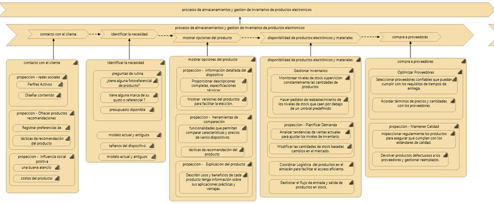

# 📦 App Gestión Will – Documentación del Proyecto

Este proyecto corresponde al desarrollo de una aplicación para apoyar la gestión, control y administración del negocio “Tecnología de Williams”, aplicando buenas prácticas de Arquitectura de Software, mapa de capacidades, diseño visual y organización de procesos internos.

La aplicación está construida con Next.js, React, TailwindCSS, componentes reutilizables y un diseño pensado para mejorar la experiencia del usuario.

Demo frontend para `Tecnología de Williams` — proyecto del Practicum 3.

## 🧭 Mapa de Capacidades

En este proyecto se desarrolló un Mapa de Capacidades del negocio Tecnología de Williams, con enfoque en:

Atención al cliente

Identificación de necesidades

Presentación de productos

Gestión de inventario

Compras a proveedores



Este mapa permitió entender completamente cómo funciona el negocio, qué capacidades internas posee y en qué puntos necesita mejorar.
##  📂 Origen del Código

El proyecto está desarrollado en Visual Studio Code bajo la carpeta:

app-gestion-will
  
##  inicializar el proyecto desde cero:

git clone <url-del-repositorio>
cd app-gestion-will
npm install
npm run dev


## Qué incluye
- Next.js + TypeScript
- Inicio de sesión con Google (Firebase Auth)
- Suscripción por correo (EmailJS)
- Gestión básica de inventarios (demo en frontend)
- Black Friday toggle (20%)
- Productos con descuentos (20% y 30%)
- Decoraciones automáticas por feriados
- Código organizado en `components/` y `app/`

## Instalación (local)
1. Clonar repo
2. Copiar `.env.local` con variables:
   - NEXT_PUBLIC_FIREBASE_API_KEY
   - NEXT_PUBLIC_FIREBASE_AUTH_DOMAIN
   - NEXT_PUBLIC_FIREBASE_PROJECT_ID
   - NEXT_PUBLIC_FIREBASE_APP_ID
   - NEXT_PUBLIC_EMAILJS_SERVICE_ID
   - NEXT_PUBLIC_EMAILJS_TEMPLATE_ID
   - NEXT_PUBLIC_EMAILJS_PUBLIC_KEY
3. Instalar dependencias:
npm install
4. Ejecutar:
npm run dev
5. Abrir http://localhost:3000

## Extras (opcional)
- Deploy en Vercel (añade variables de entorno en el dashboard de Vercel).
- Para envío de emails en producción, usar un backend o funciones seguras.

## Autor
stefany sancho bermudez - Tecnología de Williams


# Next.js & HeroUI Template

This is a template for creating applications using Next.js 14 (app directory) and HeroUI (v2).

[Try it on CodeSandbox](https://githubbox.com/heroui-inc/heroui/next-app-template)

## Technologies Used

- [Next.js 14](https://nextjs.org/docs/getting-started)
- [HeroUI v2](https://heroui.com/)
- [Tailwind CSS](https://tailwindcss.com/)
- [Tailwind Variants](https://tailwind-variants.org)
- [TypeScript](https://www.typescriptlang.org/)
- [Framer Motion](https://www.framer.com/motion/)
- [next-themes](https://github.com/pacocoursey/next-themes)

## How to Use

### Use the template with create-next-app

To create a new project based on this template using `create-next-app`, run the following command:

```bash
npx create-next-app -e https://github.com/heroui-inc/next-app-template
```

### Install dependencies

You can use one of them `npm`, `yarn`, `pnpm`, `bun`, Example using `npm`:

```bash
npm install
```

### Run the development server

```bash
npm run dev
```

### Setup pnpm (optional)

If you are using `pnpm`, you need to add the following code to your `.npmrc` file:

```bash
public-hoist-pattern[]=*@heroui/*
```

After modifying the `.npmrc` file, you need to run `pnpm install` again to ensure that the dependencies are installed correctly.

## License

Licensed under the [MIT license](https://github.com/heroui-inc/next-app-template/blob/main/LICENSE).
